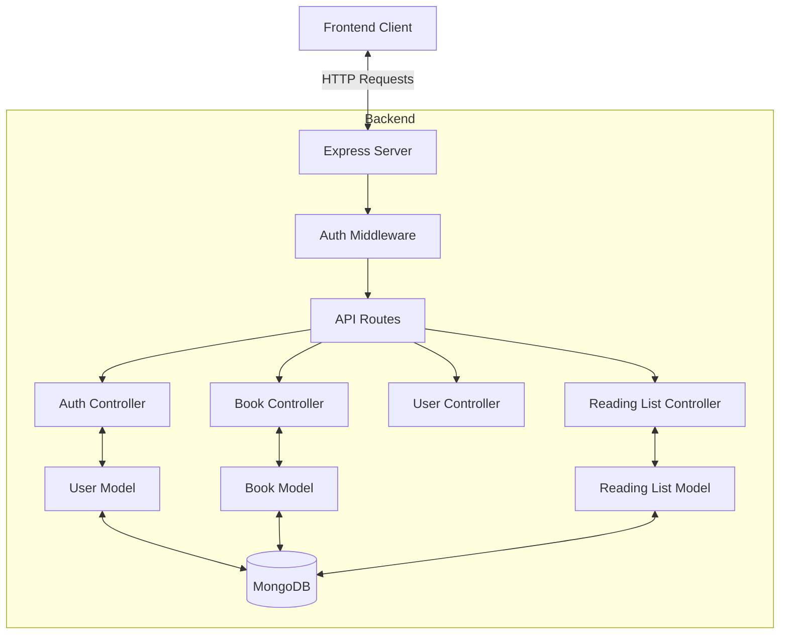
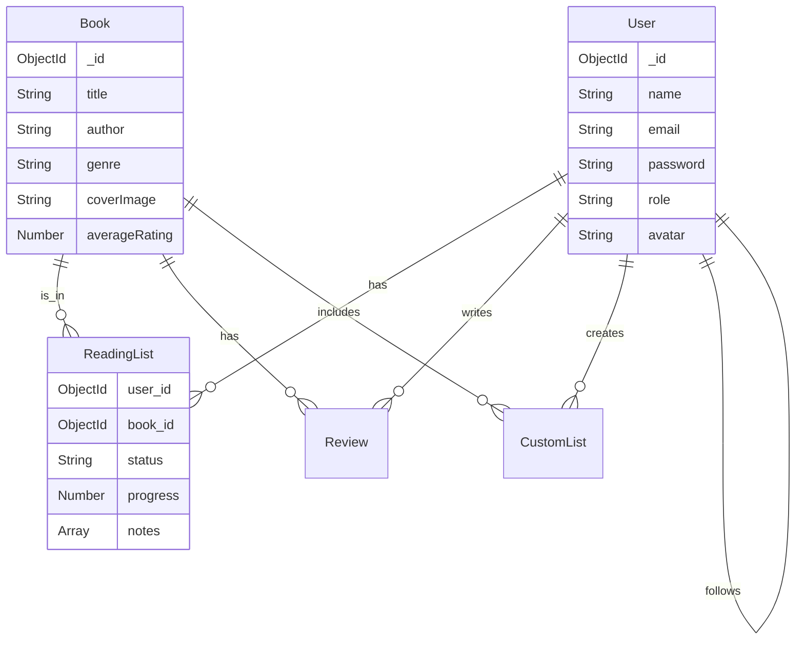
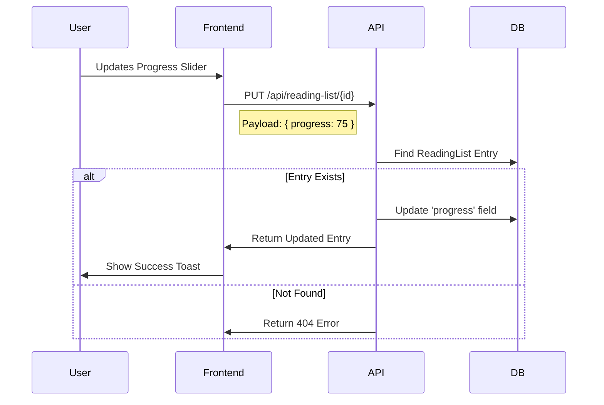

# Book Buddy 📚

Book Buddy is a comprehensive personal library management application designed to help book lovers track their reading journey. Built with the MERN stack (MongoDB, Express, React, Node.js), it offers a rich set of features for managing books, tracking progress, analyzing reading habits, and connecting with a community of readers.

## 🌟 Key Features

### 🔐 Role-Based Access Control (RBAC)
*   **Admins**: 
    *   Add new books to the global database via a dedicated dashboard.
    *   Delete books from the system.
    *   Moderate community reviews (delete irrelevant content).
*   **Users**: 
    *   Manage personal reading lists.
    *   Write reviews.
    *   View stats and profiles.

### 📖 Book Management
*   **Browse & Discover**: Explore a vast collection of books with detailed information including covers, authors, genres, and descriptions.
*   **Search & Filter**: Powerful full-text search and filtering by genre, year, and rating.
*   **Book Details**: View comprehensive details including community reviews and average ratings.
*   **AI Summary**: Instantly generate concise 3-point summaries for any book using OpenAI (GPT-3.5).

### 📝 Reading List & Tracking
*   **Status Tracking**: Categorize books into **Reading**, **Wishlist**, **Completed**, or **Dropped**.
*   **Progress Tracking**: Visual progress bars and percentage tracking for current reads.
*   **Detailed History**: Auto-capture finish dates and optionally log reasons for dropping books.
*   **Notes & Highlights**: Add page-specific notes and highlights to your current reads.

### ✍️ Social & Community
*   **Profiles**: Customized user profiles with avatars, bios, and reading stats.
*   **Follow System**: Follow other users to see their reviews and reading activities.
*   **Reviews**: detailed rating system with text reviews.

### 📊 Analytics & Reporting
*   **Visual Insights**: Interactive charts for reading velocity, genre distribution, and pages read.
*   **Export Data**: Download your reading journey as professionally formatted **PDFs** or raw **CSV** data.

### 📸 Screenshots

<div align="center">
  
  
  
  
  
  
</div>

---

## 🛠️ Technology Stack

| Component | Technology | Description |
| :--- | :--- | :--- |
| **Frontend** | React.js | Component-based UI library |
| | Tailwind CSS | Utility-first CSS framework for styling |
| | Recharts | Composable charting library for analytics |
| | Framer Motion | Library for smooth animations |
| **Backend** | Node.js | JavaScript runtime environment |
| | Express.js | Web framework for API routes and middleware |
| **Database** | MongoDB | NoSQL database for flexible data storage |
| | Mongoose | ODM for data modeling and validation |
| **Auth** | JWT | JSON Web Tokens for stateless authentication |
| **Utilities** | PDFKit | Server-side PDF generation |
| | Multer | Middleware for handling file uploads (avatars) |
| | **HTML5 Canvas** | High-performance 2D rendering for the starry background |

---

## 🏗️ Backend Architecture

The backend follows a **Model-Controller-Route (MVC)** pattern, separating concerns for scalability and maintainability.



---

## 🗄️ Database Schema

### Entity-Relationship Diagram



### Model Details

#### 1. User Model
| Field | Type | Description |
| :--- | :--- | :--- |
| `name` | String | Full name of the user |
| `email` | String | Unique email address |
| `password` | String | Hashed password (Bcrypt) |
| `role` | Enum | `user` or `admin` (Default: `user`) |
| `avatar` | String | URL to profile picture |
| `followers` | Array | References to other User IDs |
| `following` | Array | References to other User IDs |

#### 2. Book Model
| Field | Type | Description |
| :--- | :--- | :--- |
| `title` | String | Book title (Indexed for search) |
| `author` | String | Author name |
| `genre` | String | Book genre |
| `coverImage` | String | URL to cover image |
| `averageRating` | Number | Cached average rating |
| `totalRatings` | Number | Cached count of reviews |

#### 3. ReadingList Model
Links a **User** to a **Book** with personal tracking data.

| Field | Type | Description |
| :--- | :--- | :--- |
| `user` | ObjectId | Reference to User |
| `book` | ObjectId | Reference to Book |
| `status` | Enum | `wishlist`, `reading`, `complete`, `dropped` |
| `progress` | Number | Reading progress (0-100%) |
| `notes` | Array | List of page-specific notes |
| `dropReason` | String | Optional reason if status is 'dropped' |

---

## 🎮 Controllers & API Logic

The backend logic is organized into focused controllers.

| Controller | Responsibilities |
| :--- | :--- |
| **authController** | Handles Registration, Login, and fetching current user context. |
| **bookController** | Manages global book catalog, searching, filtering, and fetching single book details. |
| **readingListController** | Handles all user-specific book interactions (adding to list, updating progress, adding notes). |
| **reviewController** | Manages creating, updating, and deleting reviews. Updates Book average ratings. |
| **userController** | Handles profile updates (avatar, bio) and social features (follow/unfollow). |
| **analyticsController** | Aggregates data for charts (e.g., books read per month). |

### Logic Flow: Updating Reading Progress



---

## 🚀 Installation & Setup

### Prerequisites
*   Node.js (v14 or higher)
*   MongoDB (Local or Atlas)

### 1. Clone & Install
```bash
git clone <repository-url>
cd book-buddy

# Install Backend
cd backend
npm install

# Install Frontend
cd ../frontend
npm install
```

### 2. Environment Setup
Create a `.env` file in the `backend` directory:
```env
PORT=3000
MONGO_URI=mongodb://127.0.0.1:27017/bookbuddy
JWT_SECRET=your_secure_random_string
CLIENT_ORIGIN=http://localhost:5173
```

### 3. Run Application
**Backend** (Runs on port 3000):
```bash
cd backend
npm run dev
```

**Frontend** (Runs on port 5173):
```bash
cd frontend
npm run dev
```

Visit `http://localhost:5173` to start using Book Buddy!
